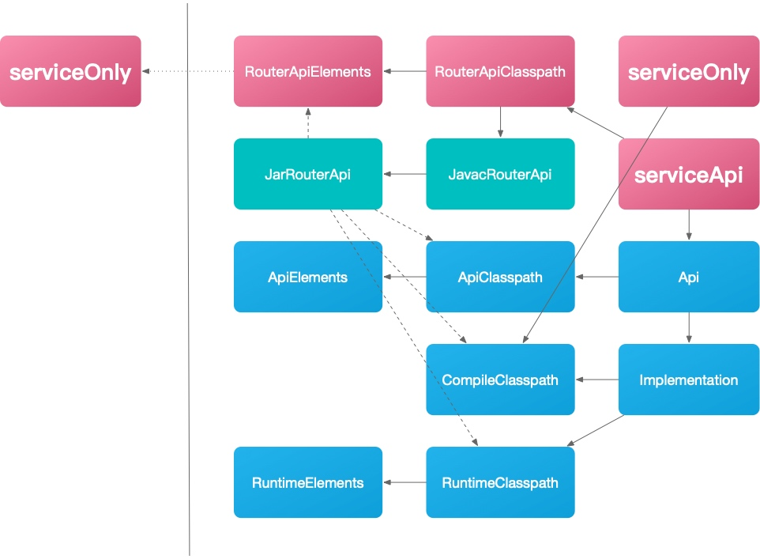

## 简介

BRouter 是一个 Kotlin 编写的面向模块 Android 路由库，支持：

* 路由
    * 泛平台路由定义
    * 自定义启动流程
    * 统一路由协议
    * 全局/模块/路由三级拦截器
    * 灵活的路由匹配/捕获规则
* 服务
    * 服务发现
    * 依赖注入
* 任务
    * 初始化去中心化
    * 自动解析任务 / 服务依赖图
    * 可选执行线程
* 模块
    * 模块生命周期
* 数据
    * 可扩展 APT
    * 元数据描述
    
## 接入

* Android Gradle Plugin >= 3.3.0
* Gradle >= 5.3
* Java >= 1.8
* Kotlin 可选


```gradle
brouter_version = "1.0.0"

dependencies {

    // androidx
    annotationProcessor "com.bilibili.android:brouter-apt:$brouter_version" // or kapt for Kotlin
    implementation "com.bilibili.android:brouter-api:$brouter_version" // API 模块，通常仅需要依赖该模块，不要依赖 core
    implementation "com.bilibili.android:brouter-core:$brouter_version" // 核心模块，仅需要配置初始化时用到
    
    // appcompat
    nnotationProcessor "com.bilibili.android:brouter-apt-appcompat:$brouter_version"
    implementation "com.bilibili.android:brouter-core-appcompat:$brouter_version"
    implementation "com.bilibili.android:brouter-api-appcompat:$brouter_version"
}

```

Application 模块需要 apply 路由插件有 2 种方式：

```gradle
buildscript {
    dependencies {
        classpath "com.bilibili.android:brouter-gradle-plugin:$brouter_version"
    }
}

apply plugin: 'com.bilibili.brouter'

```

或

```
// 插件审核中，暂时不支持该用法
plugins {
  id "com.bilibili.brouter" version brouter_version
}
```

## 使用

### 初始化

```kotlin
BRouterCore.setUp(Application) { builder : GlobalConfiguration.Builder ->
    // 自定义初始化配置，可选
}

// 初始化配置 API，每个配置项的含义请参考接口文档
interface GlobalConfiguration.Builder {
    val preMatchInterceptors: MutableList<RouteInterceptor>
    val postMatchInterceptors: MutableList<RouteInterceptor>
    val attributeSchema: AttributeSchema
    fun defaultScheme(defaultScheme: String): Builder
    fun logger(logger: SimpleLogger): Builder
    fun emptyRouteTypeHandler(handler: EmptyTypeHandler): Builder
    fun servicesMissFactory(factory: OnServicesMissFactory): Builder
    fun authenticator(authenticator: RouteAuthenticator): Builder
    fun addPreMatchInterceptor(interceptor: RouteInterceptor): Builder
    fun addPostMatchInterceptor(interceptor: RouteInterceptor): Builder
    fun routeListener(listener: RouteListener): Builder
    fun routeListenerFactory(factory: RouteListener.Factory): Builder
    fun executor(executor: ExecutorService): Builder
    fun attributeSchema(action: (AttributeSchema) -> Unit): Builder
    fun globalLauncher(globalLauncher: GlobalLauncher): Builder
    fun taskExecutionListener(taskExecutionListener: TaskExecutionListener): Builder
    fun taskComparator(comparator: Comparator<Task>): Builder
}

```

### 路由

##### 声明一个简单路由

```kotlin
@Routes(
    value = [ // 匹配规则，必填，其他均可选
        "(http|https)://www.bilibili.com/BV{bvid}",
        "bilibili://video/BV{bvid}"，
    ], 
    exported = true, // 自动生成相关的 Manifest Deep Link 信息，仅 Library 模块有效
    routeName = "VideoDetails",
    desc = "这是视频详情播放页",
    routeType = StandardRouteType.NATIVE, 
    interceptors = [CheckLoginInterceptor::class],
    launcher = CustomLauncher::class
)
@Attribute("player", "main") // 页面特性，可选
class VideoFragment
```

路由规则中末尾的`/`会被忽略，如果没有 scheme 则会使用上面初始化配置中的 defaultScheme。

这里支持 3 类路由规则，请注意，前两类路由规则不能跨越`/`，且不同路由规则是互斥的，每个段内只能应用一类，优先级从高到低分别是

1. **复合** ```(?<capture_name>path1|path2|pathN)```，其中```?<capture_name>```是可选的，括号是可嵌套的，如```(bilibili|http|https)```与```(bilibili|htt(p|ps))```匹配规则是一样的，注意括号中的字符串不能为空，即暂不支持```http(|s)```这样的格式，段内可以有多个
2. **通配** `{capture_name}` 或者 `*`, 其中`*`等价`{}`，即匹配但是不捕获，段内只能有一个
3. **前缀** ```**``` ，只能存在末尾，如```https://bilibili.com/**```，会匹配```https://bilibili.com/a/b/n```，但是不能匹配```https://bilibili.com```，一定会产生捕获，capture_name 为空字符串

上述中所有的捕获会置于匹配后的路由信息中的，通常最终会被启动器作为参数带入页面中。

##### 拦截器

拦截器分为三个级别，依次是 全局 / 模块 / 路由，其中全局又分为匹配前与匹配后，继续上面的示例

```kotlin
@Singleton
@Services
class CheckLoginInterceptor(private val loginService: LoginService) : RouteInterceptor {
    override fun intercept(chain: RouteInterceptor.Chain): RouteResponse {
        return if (!loginService.isLogin) {
            RouteResponse(RouteResponse.Code.UNAUTHORIZED, chain.request)
        } else {
            chain.proceed(chain.request)
        }
    }
}
```

路由内拦截器实例化的方式有2种，一种是尝试去取对应类的默认服务，即上面的示例，
如果不存在则调用```OnServicesMissFactory.create```，默认实现是用无参构造函数反射。

该拦截器做了登陆校验，如果未登录会返回未认证，如果上面初始化时配置了 ```RouteAuthenticator```，则会自动重定向到认证页，且认证后自动转发请求，具体用法见工程内示例。


##### 路由请求

###### RouteRequest

BRouter 通过```RouteRequest```这个类来启动路由或者获取路由信息，示例：

```kotlin

// 启动
val response = BRouter.routeTo("bilibili://video/BV1tC4y1H7yz".toRouteRequest(), this)

// 获取路由信息
val response = "bilibili://video/BV1tC4y1H7yz".toRouteRequest().newCall(CallParams(RequestMode.ROUTE, this)).execute()

```
###### RouteResponse

路由请求的结果是```RouteResponse```

```kotlin
interface RouteResponse {
    val code: Code
    val request: RouteRequest
    val message: String
    val routeInfo: RouteInfo?
    val obj: Any?
    val redirect: RouteRequest?
    val flags: Int
    val priorFailureResponse: RouteResponse?
    val priorRouteTypeResponse: RouteResponse?
    val prevRequestResponse: RouteResponse?
    enum class Code {
        OK,
        REDIRECT,
        BAD_REQUEST,
        UNAUTHORIZED,
        FORBIDDEN,
        NOT_FOUND,
        ERROR,
        FOUND_STUB,
        UNSUPPORTED,
    }
}
```
其中```RouteInfo```是路由匹配的结果，在拦截器中也可以获取到

```
interface RouteInfo : HasAttributes {
    val routeName: String
    val routeRule: String
    val routeType: String
    val captures: Map<String, String>
    val target: Class<*>
    val interceptors: Array<out Class<out RouteInterceptor>>
    val module: Module
}
```
其中每个字段的含义请参阅接口文档。

###### 统一路由协议

```RouteRequest```是统一路由协议的超集

* 任意一条统一路由协议的字符串均可转化为一个 RouteRequest 对象
* 任意一个 RouteRequest 对象也可以转化为一条统一路由协议，但是部分字段可能会丢失

举例：

```kotlin
"bilibili://video/BV1tC4y1H7yz".toBuilder()
    .routeTypes("native", "web")
    .flags(1)
    .prev("https://www.bilibili.com".toRouteRequest())
    .forward("https://baidu.com".toRouteRequest())
    .props {
        it.append("prop1", "1")
            .append("prop1", "2")
            .append("prop2", "2")
    }
    .params {
        it.append("param1", "1")
            .append("param1", "2")
    }
    .attributes {
        it.attribute("player", "main")
    }
    .build()
// 等价于
("bilibili://video/BV1tC4y1H7yz?" +
        "-Bpt.types=native&" +
        "-Bpt.types=web&" +
        "-Bpt.flags=1&" +
        "-Bpt.prev=${Uri.encode("https://bilibili.com")}&" +
        "-Bpt.forward=${Uri.encode("https://baidu.com")}&" +
        "-Bprop1=1&" +
        "-Bprop1=2&" +
        "-Bprop2=2&" +
        "param1=1&" +
        "param1=2&" +
        "-Aplayer=main").toRouteRequest()
```

```RouteRequest```中，下面的几个字段是其独享的，无法与统一路由协议互转

* extras: Bundle，额外参数
* options: 参见```startActivity(Intent intent,Bundle options)```
* animIn, animOut: 参见```Activity.overridePendingTransition(int enterAnim, int exitAnim)```

其他均可用统一路由协议表示，具体参数参见```UniformProtol```这个类。

一个最佳实践：

* 页面应当支持只需要 params 中的参数就可以正常启动，这样可以直接被 URI 唤起
* props 作为属性参数，通常用于 容器 / UI 的控制参数，而非页面的本身的逻辑参数
* attributes 用于描述页面的一些性质，当多页面路径匹配且优先级一致时才会发生匹配
* 可以认为 RouteType 是一个特殊的特质，但是发生在页面路径匹配之前，请求存在多 RouteType 时，会依次查询直到第一个成功为止

##### 更多路由功能

请参阅示例，文档待补齐。

### 服务

#### 声明服务

BRouter 支持在类上或者静态方法上声明服务

##### 注解在类上

在这种情况，BRouter会查找公开构造函数来创建服务的实例，如果有多个，则寻找```@Inject```注解的构造函数

```kotlin
interface LoginService

@Singleton // 会缓存第一个实例作为单例
@Named("v1") // 默认为 "default"
@Services(LoginService::class) // 暴露的服务类，不填则为被注解类本身
class LoginManager1 : LoginService
```

##### 注解在静态方法
```java
class LoginManager2 implements LoginService  {
    
    @Named("v2")
    @Services(LoginService.class)
    synchronized public static LoginManager getInstance(@Named("app") Application app， Provider<StorageService> storage) {
        ...
    } 
}
```

注意，无论是注解在类上还是静态方法上，其目标方法中的参数均会作为被依赖的服务来查找，通过添加```@Named("service_name")```来表示服务的名字，默认为```"default"```

#### 消费服务

##### 声明在服务的函数参数中

如上所示，服务是可以依赖服务的，通过声明对应的参数即可获取对应依赖的服务

##### 通过 @Inject 注解

```kotlin
class Consumer {
    @Inject
    @Named("v2")
    lateinit var service1: LoginService? // ? 表示 Nullable
    
    @Inject
    @Named("v2")
    lateinit var service2: Provider<LoginService>
    
    @Inject
    @Named("v2")
    lateinit var service3: Provider<out LoginService>

    init {
        BRouter.inject(this)
    }
}
```

服务的消费不单单可以直接获取实例，也可以以```Provider<T>```或 ```Provider<? extends T>```来获取一个延时创建实例的 Provider

##### 直接获取
```kotlin
val service = BRouter.services.getService(LoginService::class.java, "v1") 
```

值得注意的是，通过注解静态注册的方式，可以获得编译期的检查，确保被依赖的服务均存在且不存在循环依赖，另外可通过添加```@Nullable```注解或者 Kotlin 的 ? 语法表示服务是可空的


### 模块

##### 声明模块

所有的路由与服务均归属于模块，通过注解```@ModuleOptions```来显示声明一个模块，如果不声明模块则会隐式的创建

```java
@ModuleOptions(name = "test")
public class TestModule extends ModuleActivator {

    private final TeenagerService service;

    public TestModule(TeenagerService service) {
        this.service = service;
    }

    @Override
    public void onCreate(@NotNull ModuleContext context, @NotNull ModuleConfigurationModifier modifier) {
        super.onCreate(context, modifier);
        modifier.addModuleInterceptors(chain -> {
            if (service.isEnabled()) {
                return RouteResponseKt.redirectTo(chain.getRequest(),
                        RouteRequestKt.toRouteRequest("bilibili://teenager"));
            } else {
                return chain.proceed(chain.getRequest());
            }
        });
    }
}
```

如果模块注解的类可选继承```ModuleActivator```，以处理对应的回调
```onCreate``` ```onPostCreate```，注意以下几点：

1. 所有归属这个模块的服务，均隐式的依赖了这个模块的```onCreate```
2. 可以构造函数在构造函数中声明对其他模块服务的依赖
3. ```onCreate``` 与 ```onPostCreate``` 其实是特殊的 Task，因此可以在上面加```TaskOptions```注解来配置任务
4. ON_DEMAND 模块的 ```onCreate``` 在模块的路由或者服务第一次被获取时触发或者手动触发
5. ON_INIT 则在```BRouterCore.setUp```触发，均为异步

##### 模块 API

```kotlin
val module = BRouter.module("test")

// 模块 API
interface Module : HasAttributes {
    val name: String
    val mode: BootStrapMode
    val status: ModuleStatus
    val moduleInterceptors: List<RouteInterceptor>
    val tasks: TaskContainer
    fun moveStatusTo(status: ModuleStatus) // 手动触发状态转移
    @Throws(InterruptedException::class)
    fun awaitAtLeast(status: ModuleStatus) // 同步等待状态
    fun whenStatusAtLeast(status: ModuleStatus, action: (Module) -> Unit) // 异步监听状态
}
```

##### 多模块

BRouter 支持在一个 Gradle Project 内声明多个模块

```kotlin 
annotation class ModuleOptions(
    val name: String,
    val mode: BootStrapMode = BootStrapMode.ON_INIT,
    val desc: String = "",
    val defaultModule: Boolean = true
)
```

但是请注意，路由 / 服务 / 任务 在未指定所属模块时，会属于默认模块，即当存在多个模块时，应当只能有一个模块为 defaultModule = true。

另外声明路由 / 服务 / 任务 时，可通过注解```@BelongsTo```来指定所属的模块

``` koltin 
annotation class BelongsTo(val value: String)
```

### 任务

BRouter 的任务是一次性的，用完即毁，仅适用于启动任务，通过```@TaskOptions```，标注一个实现```TaskAction```的类，即可声明一个任务：

```kotlin
@TaskOptions("task2", dependencies = ["lib2.task1"], threadMode = ThreadMode.ANY)
public class Task2(@Named("v1") service: LoginService) : TaskAction {
    override fun execute(task: Task) {
        executor = Executors.newSingleThreadExecutor()
    }

    @Named("cached")
    @TaskOutput(ExecutorService::class, Executor::class)
    lateinit var executor: ExecutorService
}
```

同样，构造函数可依赖服务，比较特别的是，```@TaskOutput```会产生服务，而且因为 Task 一次性的性质，```@TaskOutput```产生的服务是单例的，所以慎用。

Task 也是归属一个模块的，因此在```dependencies```里声明对其他 Task 名的依赖时，要注意如果是其他模块的 Task 要加上模块名字与点，如果是同模块的可以只写 Task 名。


### 数据

BRouter 是数据驱动的，所有的 Route / Service / Task / Module 均由 JSON 文件描述，因此拥有了强大的扩展性。

##### 自定义 APT

众所周知 APT 是通过实现 Processor 这个接口并注册到 SPI 中来实现的，BRouter 借鉴了这个思想，将 Processor 中的回调做二次转发给 MetaProcessor 给来收集元信息，并在最后一轮生成元数据文件与 Java 代码。

包括 BRouter 自身的注解也是通过 MetaProcessor 来收集的，有兴趣的同学可以一阅源码，这里给一个简单的示例，我们以 ARouter 中的 Route 注解为例：

```kotlin
@AutoService(MetaProcessor::class)
class CompatRouteProcessor : MetaProcessor {
    override val supportedAnnotations: Set<String>
        get() = setOf(Route::class.java.name)

    override fun process(
        annotations: Set<TypeElement>,
        roundEnv: RoundEnvironment,
        processingEnv: ProcessingEnvironment,
        collector: MetaCollector
    ) {
        roundEnv.getElementsAnnotatedWith(Route::class.java).forEach { element ->
            element as TypeElement
            collector.addRoute { builder ->
                val route = element.getAnnotation(Route::class.java)
                builder.className(element.javaClassName)
                    .routeRules(listOf(route.path.also {
                        require(it.isNotEmpty()) {
                            "Path is empty."
                        }
                    }))

                route.name.let {
                    if (it.isNotEmpty()) {
                        builder.routeName(it)
                    }
                }

                builder.attributes(
                    listOf(
                        "group" to route.group,
                        "extras" to route.extras.toString()
                    )
                )
            }
        }
    }
}
```

示例里用了 Google 的 AutoService 来自动生成服务描述文件，也可以替换成手写。将其注册到```annotationProcessor```或```kapt```中即可实现对 ARouter 中```@Route```注解的兼容。

通过类似上面的方式，可以很方便的将其他版本的路由迁移到 BRouter 中。

##### 数据模型

编译 Application 模块后，BRouter 会在```build/outputs/${variant_name}/brouter``` 下产生描述所有上述功能的元数据 JSON。

通过解析该文件，可用于 CI / CD / 自动化测试 / 数据可视化等。

### 路由插件

插件的所有产物均在 build/intermediates/brouter 与 build/outputs/brouter 目录下，可自行查找。

路由插件只有一个 id，但是在不同的模块下有不同的效果

```groovy
apply plugin: 'com.bilibili.brouter'
```

#### Application 

Application 模块必须要 apply 路由插件来生成必要的类，否则无法使用。

另外可配置导出 Deep Link 的目标类，所有要导出的路由会生成对应的 AndroidManifest 信息，如果不配置类名则忽略。

```kotlin
brouter {
    exportedActivityClass("com.bilibili.brouter.example.EntranceActivity")
}
```

#### Library

Library 模块下插件有 2 个功能

##### Android Test
插件同样可以为 Android Test 生成对应的类，因此当模块 A 依赖模块 B 的暴露服务时，在构建测试 APK 时可以选择依赖模块 B 的实现或者在 A 的 androidTest 下用注解 mock B 的实现。

##### 导出模块服务

当模块需要暴露服务时，可使用路由插件，将需要暴露的 API 定义在 src/${sourceSetName}/api 目录下，目前仅支持 Java。


```groovy

// A
dependencies {
    // API 编译需要依赖的外部类使用 serviceApi 来依赖，例如暴露的接口用到了 RxJava
    serviceApi "io.reactivex.rxjava3:rxjava:3.0.0"
    
    // 只为 release 依赖
    releaseServiceApi ...
    
    // 依赖另一个模块导出的 API
    serviceOnly project(":B")
}

// B
dependencies {
    serviceOnly project(":A")
    // 如果 Library 打包时 apply 了路由插件，远程依赖也可以通过这种方式来获取暴露的服务
    serviceOnly "com.bilibili:x:1.0.0"
}

// 支持模块之间互相依赖彼此导出的 API
```

简单的原理图


## Java

所有的 Kotlin 示例或者 API 均支持 Java，请自行查阅。

## 混淆

*brouter-core* 中自带了混淆规则，无需特别配置

## 沟通

* 推荐在 Issues 下留言沟通
* 联系作者 dieyidezui@gmail.com

## 致谢

* [Gradle](https://github.com/gradle/gradle) 
* [OkHttp](https://github.com/square/okhttp)

## License

    Licensed under the Apache License, Version 2.0 (the "License");
    you may not use this file except in compliance with the License.
    You may obtain a copy of the License at

       http://www.apache.org/licenses/LICENSE-2.0

    Unless required by applicable law or agreed to in writing, software
    distributed under the License is distributed on an "AS IS" BASIS,
    WITHOUT WARRANTIES OR CONDITIONS OF ANY KIND, either express or implied.
    See the License for the specific language governing permissions and
    limitations under the License.


